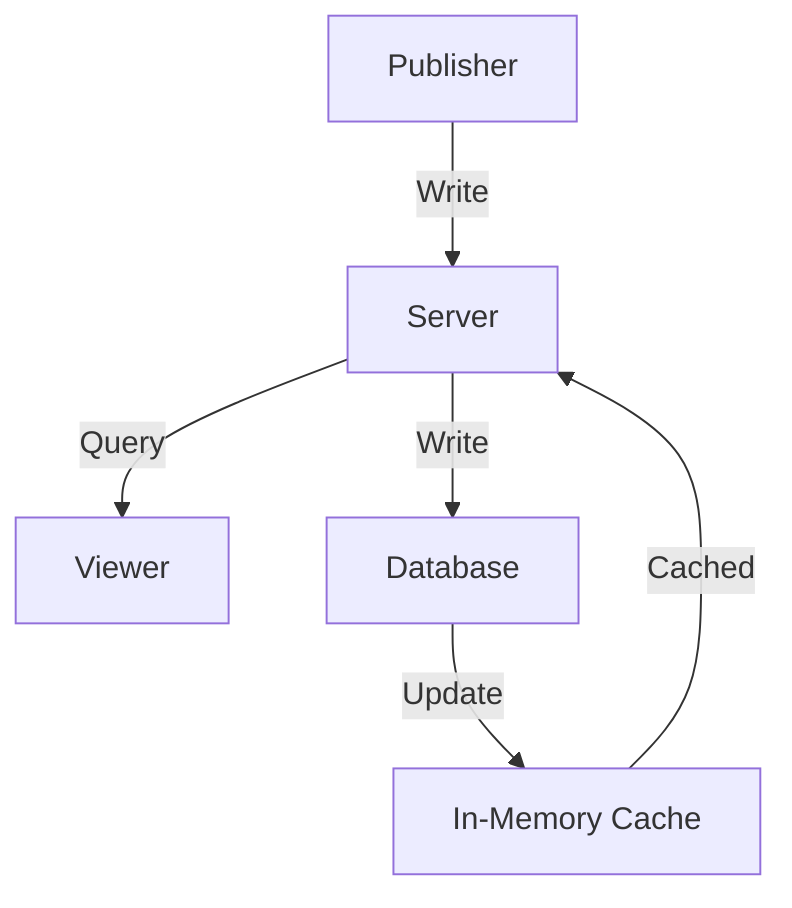

# Dcard Internship Assignment 2024

Golang + MongoDB

## Assignment

The assignment can be found here: <https://drive.google.com/file/d/1dnDiBDen7FrzOAJdKZMDJg479IC77_zT/view>

TL;DR: Create a simple advertisement HTTP API server using Golang. External libraries and tools are allowed.

## Analysis

Numbers go first.

- ~3000 AD creations per day
- **~10000 AD views per second**
- ~1000 active ads at any given time

This assignment is quite simple. I don't want to over-engineer it with reverse proxies, load balancers, etc.

I think Golang is enough for this one, but considering the ease of use and scalability for data management, I choose MongoDB as the database.

> SQL or NoSQL is not a big deal for this assignment. Replication and sharding can always solve the problem I'm facing.

An RPS of 10k will be the primary challenge.

Golang is fast enough to handle this load, so the bottleneck will be the database.

Preliminary tests show MongoDB with indexes can handle around 2k RPS on my MBP, still far from the target.

Some cache mechanism is needed. Redis? No, only 1000 active ads, so I can cache them all in memory.

The tech stack becomes obvious:

- Golang / GIN for the HTTP server
- MongoDB for data storage
- Docker / Kubernetes for deployment (later)

## Design

Low latency/high throughput for the READ operation is the primary goal; no one wants to wait for an ad to load.
The WRITE operation is not that frequent, so it's not a big deal. Also, a few seconds of ad publishing delay is acceptable.

To reduce the latency, I will cache the ads in memory and update the local memory cache every second, so the cache will be eventually consistent.



## Result

I used K6 for load testing.

Environment:
- MacBook Pro M1 Pro 16GB, DevContainer (5 cores)
- Go 1.21.7
- MongoDB 7.0.2
- K6 0.49.0

### First Iteration

The result is quite good for the first iteration in DevContainer.

```bash
scenarios: (100.00%) 1 scenario, 300 max VUs, 40s max duration (incl. graceful stop):
        * default: 300 looping VUs for 10s (gracefulStop: 30s)


data_received..................: 193 MB 19 MB/s
data_sent......................: 10 MB  1.0 MB/s
http_req_blocked...............: avg=173.72µs min=375ns    med=792ns   max=175.38ms p(90)=1.87µs  p(95)=2.7µs   
http_req_connecting............: avg=164.91µs min=0s       med=0s      max=141.21ms p(90)=0s      p(95)=0s      
http_req_duration..............: avg=39.91ms  min=126.2µs  med=34.89ms max=214.87ms p(90)=66.72ms p(95)=78.79ms 
{ expected_response:true }...: avg=39.91ms  min=126.2µs  med=34.89ms max=214.87ms p(90)=66.72ms p(95)=78.79ms 
http_req_failed................: 0.00%  ✓ 0           ✗ 71399
http_req_receiving.............: avg=662.3µs  min=4.7µs    med=13.16µs max=157.87ms p(90)=70.83µs p(95)=163.75µs
http_req_sending...............: avg=105.1µs  min=2µs      med=4.2µs   max=137.76ms p(90)=11.54µs p(95)=28.54µs 
http_req_tls_handshaking.......: avg=0s       min=0s       med=0s      max=0s       p(90)=0s      p(95)=0s      
http_req_waiting...............: avg=39.14ms  min=104.66µs med=34.45ms max=183.84ms p(90)=65.37ms p(95)=76.49ms 
http_reqs......................: 71399  7135.616822/s
iteration_duration.............: avg=41.61ms  min=540.91µs med=35.99ms max=223.15ms p(90)=69.52ms p(95)=82.84ms 
iterations.....................: 71399  7135.616822/s
vus............................: 300    min=300       max=300
vus_max........................: 300    min=300       max=300
```

7K RPS, with less than 100% CPU usage for the server (K6 consumes the rest, 300%+, totaling 500% for 5 cores)
I believe the number can be doubled outside the DevContainer.

### Second Iteration

After some side work on k6 and disabling the debug log, the result is blazing fast compared to the first iteration.

> The k6 URL builder and logger IO caused the server cannot use all the CPU power.

```
scenarios: (100.00%) 1 scenario, 500 max VUs, 40s max duration (incl. graceful stop):
        * default: 500 looping VUs for 10s (gracefulStop: 30s)


data_received..................: 869 MB 87 MB/s
data_sent......................: 46 MB  4.6 MB/s
http_req_blocked...............: avg=15.99µs  min=250ns   med=417ns  max=41.18ms  p(90)=834ns   p(95)=1.16µs 
http_req_connecting............: avg=10.41µs  min=0s      med=0s     max=31.58ms  p(90)=0s      p(95)=0s     
http_req_duration..............: avg=15.03ms  min=49.95µs med=6.4ms  max=154.56ms p(90)=42.5ms  p(95)=54.04ms
{ expected_response:true }...: avg=15.03ms  min=49.95µs med=6.4ms  max=154.56ms p(90)=42.5ms  p(95)=54.04ms
http_req_failed................: 0.00%  ✓ 0            ✗ 323240
http_req_receiving.............: avg=844.43µs min=3.29µs  med=7.5µs  max=59.84ms  p(90)=58.7µs  p(95)=2.73ms 
http_req_sending...............: avg=36.36µs  min=1.37µs  med=2.29µs max=72.13ms  p(90)=4.29µs  p(95)=14.79µs
http_req_tls_handshaking.......: avg=0s       min=0s      med=0s     max=0s       p(90)=0s      p(95)=0s     
http_req_waiting...............: avg=14.15ms  min=43.12µs med=6.28ms max=140.83ms p(90)=39.69ms p(95)=48.96ms
http_reqs......................: 323240 32266.303532/s
iteration_duration.............: avg=15.41ms  min=65.37µs med=6.73ms max=154.58ms p(90)=43.03ms p(95)=54.67ms
iterations.....................: 323240 32266.303532/s
vus............................: 500    min=500        max=500 
vus_max........................: 500    min=500        max=500
```

32K RPS, with 250% CPU usage for the server (K6 consumes the rest, 200%+, totaling 500% for 5 cores)

> Note: VUS has been increased from 300 to 500.
